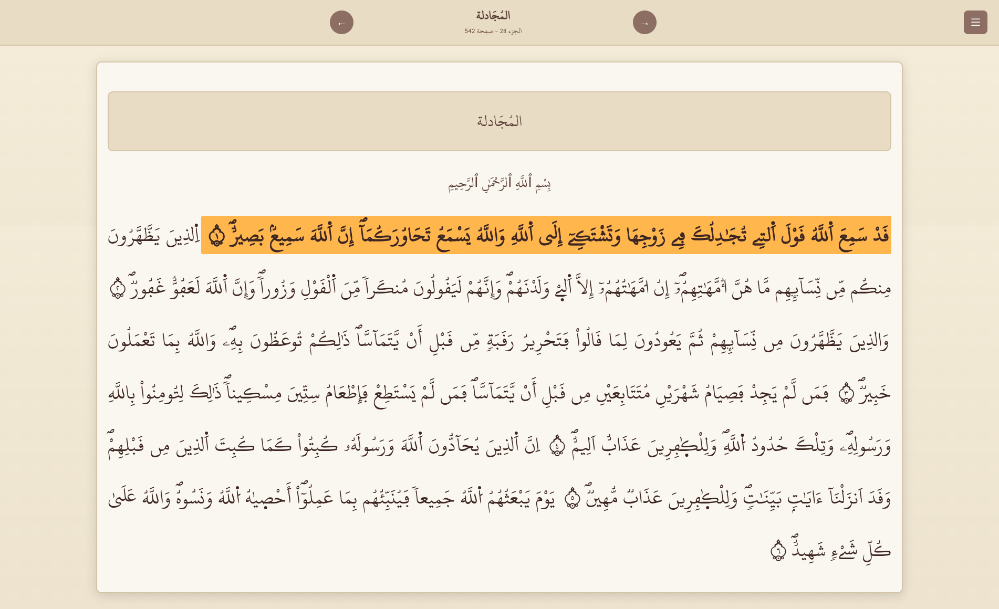
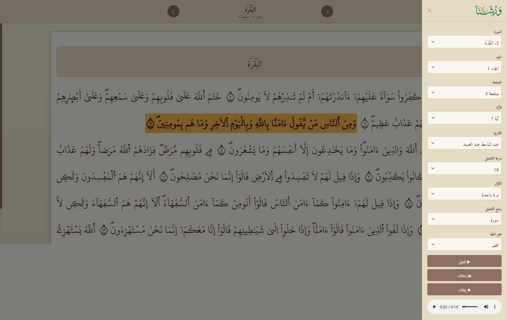

  

A lightweight, offline/online-friendly Mushaf **Warsh** web app (Arabic / RTL) that lets you browse the Qur’an by Surah, Juz’, or Page and listen verse-by-verse audio with playback controls.

## Screenshots

  
  &nbsp;
  

## Features

- Navigate by Surah, Juz, Page, or Ayah from a sidebar
- Verse-by-verse audio playback with multiple reciters
- Play modes: ayah, page, surah, or juz
- Playback speed (0.5×–2×) and repeat controls (including infinite)
- Adjustable Qur'an text font size
- Active ayah highlighting with auto-scroll
- Settings persist via `localStorage` across sessions

## Keyboard Shortcuts

| Key | Action |
|---|---|
| `Space` | Play / Pause |
| `ArrowLeft` | Seek forward 5s |
| `ArrowRight` | Seek backward 5s |
| `0–9` | Seek to 0%–90% |
| `+` / `-` | Increase / Decrease speed |

## Credits

- **Qur'an text (Warsh):** [King Fahd Glorious Qur'an Printing Complex](https://qurancomplex.gov.sa/quran-dev/)
- **Audio:** [VerseByVerseQuran.com](https://www.versebyversequran.com/)
- **Font:** Maghribi-style Uthmanic Warsh script (`uthmanic_warsh_v21.ttf`)
- **UI framework:** Bootstrap 5 RTL
