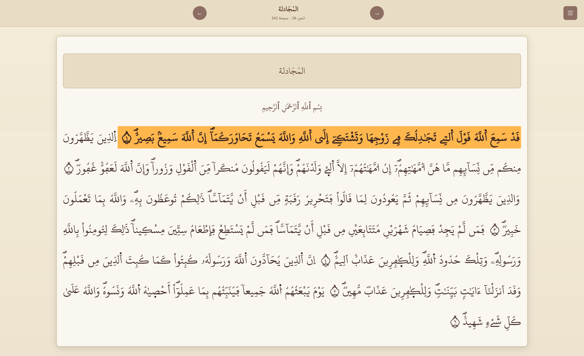
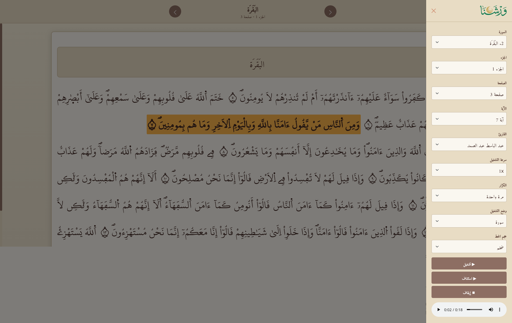
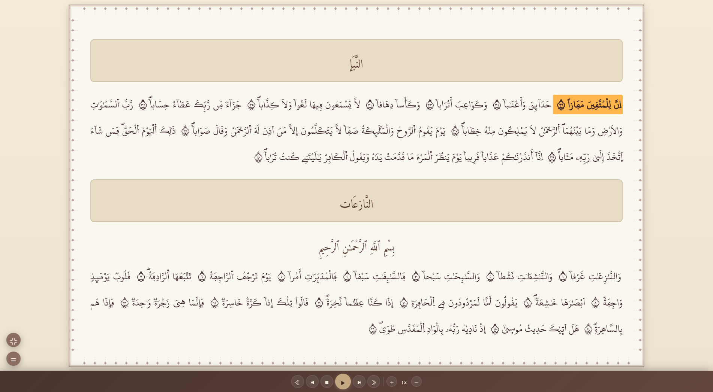

<p align="center">
  <a href="#" target="_blank">
    
  </a>
</p>
<hr/>

**English** | [العربية](./README.ar.md)

---

A lightweight, offline/online-friendly Mushaf web app (Arabic / RTL) supporting both **Warsh** and **Hafs** riwayas. Browse the Qur'an by Surah, Juz', or Page and listen verse-by-verse audio with full playback controls.

> 🌐 **Live site:** [sarayan.pages.dev](https://sarayan.pages.dev/)
> 📦 **Android APK:** [Download from Releases](https://github.com/zedsalim/sarayan/releases)

## Screenshots

<p align="center">
  
  &nbsp;
  
  &nbsp;
  
</p>

## Features

- **Two riwayas:** switch between Warsh (رواية ورش عن نافع) and Hafs (رواية حفص عن عاصم) instantly — click the badge in the header or use the sidebar selector
- Navigate by Surah, Juz, Page, or Ayah from a sidebar
- Verse-by-verse audio playback with multiple reciters per riwaya — reciters are fetched live from the [mp3quran.net API](https://www.mp3quran.net/api/v3)
- Ayah-level timing support for reciters that provide it (seek + auto-advance)
- Play modes: ayah, page, surah, or juz
- Playback speed (0.5×–2×) and repeat controls (including infinite)
- Adjustable Qur'an text font size
- Active ayah highlighting with auto-scroll
- Toggle fullscreen reading mode
- Settings persist via `localStorage` across sessions

## Running the App

You can use the app in three ways:

- **Online (no setup):** visit [sarayan.pages.dev](https://sarayan.pages.dev/) directly in your browser.
- **Android:** download and install the APK from [Releases](https://github.com/zedsalim/sarayan/releases) _(enable "Install from unknown sources" if prompted)_.
- **Locally:** clone the repo and serve it yourself.

### 1. Get the code

```bash
git clone https://github.com/zedsalim/sarayan
cd sarayan
```

### 2. Serve it locally

The app must be served over HTTP — opening `index.html` directly won't work. Pick any of these:

```bash
# Python 3
python -m http.server 3000

# Python 2
python -m SimpleHTTPServer 3000

# Node.js (npx)
npx serve .

# VS Code
# Install the "Live Server" extension and click "Go Live"
```

Then open [http://localhost:3000](http://localhost:3000) in your browser.

> **Note:** Audio is streamed directly from [mp3quran.net](https://www.mp3quran.net/) — an internet connection is required for playback.

## Text Data

Qur'an text is stored in `assets/text/` separated by riwaya:

```
assets/text/
├── warsh-quran.min.json         ← Warsh text (KFGQPC, 6214 ayahs)
└── hafs-quran.min.json          ← Hafs text (KFGQPC v2.0, 6236 ayahs)
```

Both files share the same JSON structure:

```json
{
  "id": 1,
  "jozz": 1,
  "page": 1,
  "sura_no": 1,
  "sura_name_en": "Al-Fātiḥah",
  "sura_name_ar": "الفَاتِحة",
  "line_start": 2,
  "line_end": 2,
  "aya_no": 1,
  "aya_no_marker": "ﰀ",
  "aya_text": "بِسْمِ اِ۬للَّهِ اِ۬لرَّحْمَٰنِ اِ۬لرَّحِيمِ"
}
```

The `aya_no_marker` field contains the KFGQPC PUA glyph (`U+FC00 + aya_no - 1`) used by Hafs. For Warsh, the app ignores this field and instead renders Arabic-Indic digits (e.g. `٣`) directly — compatible with the `warsh-v8-full` font and any standard Arabic font.

## Keyboard Shortcuts

| Key          | Action                    |
| ------------ | ------------------------- |
| `Space`      | Play / Pause              |
| `ArrowLeft`  | Next ayah                 |
| `ArrowRight` | Previous ayah             |
| `0–9`        | Seek to 0%–90%            |
| `+` / `-`    | Increase / Decrease speed |

## Credits

- **Qur'an text & fonts:** [King Fahd Glorious Qur'an Printing Complex (KFGQPC)](https://qurancomplex.gov.sa/quran-dev/)
  - Warsh font: `uthmanic_warsh_v21.ttf` (KFGQPC Warsh Uthmanic script)
  - Hafs font: `uthmanic_hafs_v20.ttf` (KFGQPC Hafs Uthmanic script)
- **Audio:** [mp3quran.net API](https://www.mp3quran.net/api/v3)
- **UI framework:** Bootstrap 5 RTL
